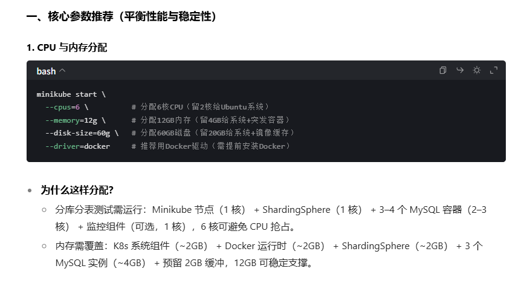
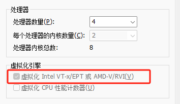

# start minikube with vmware

## 环境

物理机环境
- win11
- cpus:16核心 32线程
- 48GB内存
- 1.5TB ssd

**预安装软件环境**：
- ubuntu22.04 LTS
- vmware 17 pro

## minikube配置推荐

**务必开启“Intel VT-x/EPT 或 AMD-V/RVI”**
开启 “Intel VT-x/EPT 或 AMD-V/RVI” 是让 Minikube 在 VMware 虚拟机中实现嵌套虚拟化和资源隔离的必要条件，缺一不可

## Step1 配置ubuntu
**设置ubuntu root密码**
~~~bash
# 设置ubuntu root密码
sudo passwd root
~~~

**推荐*设置代理，访问国外访问资源**
1. 开启clash的allow lan、系统代理、TUN模式（支持UDP协议）
2. 配置物理机的局域网ip地址作为虚拟机的代理地址
**配置开关代理的脚本**：nano ~/proxy.sh
~~~bash
#!/bin/bash
# 用法：
#   source proxy.sh on   # 开启代理
#   source proxy.sh off  # 关闭代理
#   source proxy.sh      # 显示当前状态

PROXY_SERVER="http://192.168.5.173:7890"
NO_PROXY_LIST="localhost,127.0.0.1,192.168.49.2"

enable_proxy() {
    export http_proxy="$PROXY_SERVER"
    export https_proxy="$PROXY_SERVER"
    export ftp_proxy="$PROXY_SERVER"
    export no_proxy="$NO_PROXY_LIST"
    echo "Proxy 已开启: $PROXY_SERVER"
}

disable_proxy() {
    unset http_proxy
    unset https_proxy
    unset ftp_proxy
    unset no_proxy
    echo "Proxy 已关闭"
}

show_status() {
    if [ -n "$http_proxy" ]; then
        echo "当前 Proxy 已开启: $http_proxy"
    else
        echo "当前 Proxy 已关闭"
    fi
}

case "$1" in
    on)
        enable_proxy
        ;;
    off)
        disable_proxy
        ;;
    *)
        show_status
        ;;
esac
~~~
赋予可执行权力
~~~bash
chmod +x ~/proxy.sh
~~~

在 ~/.bashrc 加入：
~~~bash
source ~/proxy.sh
~~~

开关代理：
~~~bash
source ~/proxy.sh on   # 开启代理
source ~/proxy.sh off  # 关闭代理
~~~

3. 测试
~~~bash
curl -I https://www.google.com
~~~

## Step2 配置docker+minikube环境

~~~bash
# 安装Docker
sudo apt update && sudo apt install -y docker.io
# 启动Docker并设置开机自启
sudo systemctl enable --now docker
# 将当前用户加入docker组（避免每次用sudo）
sudo usermod -aG docker $USER && newgrp docker

# 下载v1.30.1版本（较稳定）
curl -LO https://storage.googleapis.com/minikube/releases/v1.30.1/minikube-linux-amd64

# 赋予执行权限并安装
chmod +x minikube-linux-amd64
# 安装到系统路径
sudo install minikube-linux-amd64 /usr/local/bin/minikube
# 验证安装
minikube version  # 输出版本信息即成功
~~~

## Step3 启动minikube
~~~bash
minikube start \
  --cpus=6 \ # 分配cpu核心
  --memory=12g \ # 分配内存大小
  --disk-size=60g \ # 分配磁盘大小
  --driver=docker \ # docker
  --force # 强制以root启动
~~~